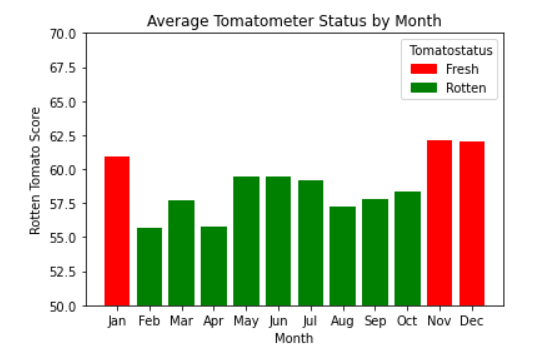
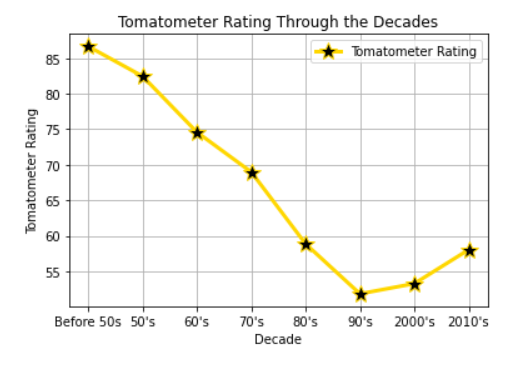
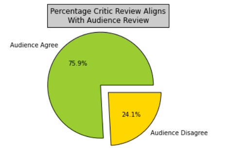
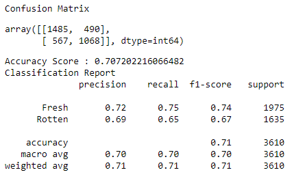

# Rotten Tomatoes Analysis

## Outline

### [Presentation Link](https://docs.google.com/presentation/d/1909wBgXJnzSyIINJgRwpWJpaoihOYW93agS8IwppOFI/edit#slide=id.g1124feebbbe_2_33)

### Topic: Movies
Our group selected this topic because the movie industry has been severely impacted by COVID and we are interested in analyzing what makes movies successful or not to help future movie makers. We are going to look at data from the Rotten Tomatoes website to compare movies rated Fresh and Rotten in the hopes of being able to predict how a future movie will be rated.
### Dataset
The datasets used in the project are hosted on the Kaggle database. They can be downloaded at the following link:  
[Kaggle Dataset](https://www.kaggle.com/stefanoleone992/rotten-tomatoes-movies-and-critic-reviews-dataset?select=rotten_tomatoes_movies.csv)
### Goal
The selected topic for our model is based on the dataset pertaining movie’s tomato status given by critics. This topic was selected so that we can understand what features are important to receiving a fresh or rotten status. In our source data we have information that includes 22 columns:
 

| Columns|  |  |
| :---:         |     :---:   |      :---: |
| Movie Link   | Movie Title    | Movie Information   |
| Critic Consensus    | Content Rating      | Genres      |
| Directors    | Authors      | Actors     |
| Original Release Date    | Streaming Release Date     | Runtime    |
| Production Comany    | Tomatometer Status     | Tomatometer Ratings     |
| Tomatometer Count    | Audience Status      | Audience Rating   |
| Audience Count    | Tomatometer Top Critic Ratings     | Tomatometer Top Fresh Critic Ratings     |
| Top Rotten Critic Ratings  |        |       |

The goal of this project is to understand what features will help us determine which movies will receive a tomato status of fresh or rotten. We will use tomato status as our target for our model. We hope to construct a model that will accurately predict tomato status for future movies.  

## Team Members

- Briana Brown
- Devin Hughes
- Priscilla Van Dyke

## Tools and Techniques

### Data Cleaning and Analysis
We plan to primarily use Pandas to clean and analyze the data. For some of the columns, natural language processing will be necessary, so we intend to use NLTK. For our visualizations we used Matplotlib.
### Database Storage
Since our data is tabular, we used a PostgreSQL database. In order to integrate with the other pieces of the project we intend to use SQLAlchemy to make the connection.
### Machine Learning
Our supervised machine learning model will use scikit-learn to create the classifier and split the data into training and testing sets. We intend to start with a Random Forest algorithm since it can handle outliers, nonlinear data, and large datasets. We hope to avoid overfitting and increase overall model performance with ensemble learning.
### Dashboard
We plan to build our dashboard using Flask to add interactive elements.

## Challenges
We faced a few challenges when tackling this project. The dataset required efficient preprocessing to be able to use the dataset optimally. Some of the columns in our dataset needed to be separated into new columns and condensed to be used for our maching model The dataset also lacked some features that might have helped in predicting tomatometer status. Another challenge of our model was the ability to predict opinion. The features of our dataset could only predict so much and opinion is subject to change and be based on a variety of factors.

## Exploratory Analysis
To analyze our dataset we started off by addressing missing or duplicate columns. We dropped rows including NaN values and looked to see if there were any duplicate rows. We found the datatypes for each column to see if the was a need to correct or change any datasets. We ensured that columns that could be used for computation or that might need to be used for visualizations had the correct datatype. Of our 22 columns, we found critics consensus to be not of use for any analysis and dropped the column. Next, we analyzed different columns to see which we could use in our analysis. We found that the categorical data in tomatometer_status gave us the most to try to predict. We created bar charts of different features to see if there were any recognized patterns between features and tomatometer status. With the data we have in our dataset, we found that it would be best to try to use our information to try to predict tomatometer status. We looked at a few trends to see if there was any patterns in ratings through time.  
 

 
The bar above shows how movies far throughout the year. According to the graph created from the dataset, movie seem to have better ratings in the winter months.  

The line graph above shows a decline in tomatostatus ratings as time has gone by. This may be due to several different factors. For each decade the number of movies increase with before the 50s having a total movie count of 577 while the latest decades in the 2000s each have over 4,000 movies rated. As time has gone on, movies have saturated the business. The constant making and remaking of movies may have lessened the quality of movies that are being released today. There also may have been increased standards on films. With less films in the past, they may have had lower standards as the movie business was first emerging and this might account for the higher ratings of movies in the past.  
 

For our analysis we focused on critic reviews of films. We also acknowledged audience had separate opinions and wanted to see how these aligned with critics' opinions. The pie chart above shows the percentage of the movies that audience and critics held the same opinions. We felt that this percentage was high enough that the critic reviews would be enough for our current model as a target feature.

## Machine Learning Model

### Preprocessing
- Since almost half of the critics_consensus column was missing values, we decided to drop that column as it was determined not to be beneficial.
- We decided to remove the remaining rows of data with null values, since it was a small percentage of the data, and we would still have plenty of information to work with.
- For our target column, tomatometer_status, we replaced "Certified-Fresh" with "Fresh" so we would have a binary classification problem.
- The content_rating column had only 6 unique categorical values, so we were able to encode it.
- The movie_info text column was cleaned by transforming to lowercase, removing punctuation, word tokenization, removing stopwords, removing numbers, and stemming.

### Feature Selection and Feature Engineering
There were several columns that we knew we were not going to use in our model for various reasons.
- The rotten_tomatoes_link column is for identification only so is not beneficial.
- Since we are trying to predict tomatometer_status before a movie is reviewed, we could not use any rating columns in our model. These include tomatometer_rating, tomatometer_count, audience_status, audience_rating, audience_count, tomatometer_top_critics_count, tomatometer_fresh_critics_count, and tomatometer_rotten_critics_count.

Most of the remaining columns are object/string data type and have way too many unique values for a traditional binning process to later encode, so we had to think of other ways to engineer features.
- The genres column is a comma separated string of all the relevant genres for each movie. We created a column for each unique genre and for each movie/row listed a 1 if it included that genre and 0 otherwise. We also added a column for the total number of genres. 
- For the movie_title and movie_info columns, we created new features based on text length analysis. This includes word count and character count for each.
- The production company column is very inconsistent with company names and would have taken too much time to fully clean. Instead, we created columns for the largest grossing production companies (Walt Disney, Warner Bros., Sony Pictures, Universal, 20th Century Fox, and Paramount Pictures) and for each movie/row we listed a 1 if there was a partial string match for the company and a 0 otherwise. We also added a binary column if it was one of the top production companies or not.
- For the directors column we created buckets for top, mid, low, and one based on the frequency of each unique name appearing in the dataset, with the idea that the more movies someone has directed, the better director they are, since the majority do not direct a second film.
- For the actors column we used the same logic/process as directors by counting the number of people in each movie that fell into each actor frequency bucket (top and mid only since too many names for other buckets).

### Training and Testing
The data was split into training and testing sets using the scikit-learn function `train_test_split`. We used the default settings, so our training set is 75% of the data and the testing set is 25%.

### Model Choice
We chose a `RandomForestClassifier` model because ensemble learning can increase overall performance and we wanted to avoid overfitting. Random Forest algorithms are beneficial because they can handle outliers, nonlinear data, and large datasets. They can also rank features by importance which may be helpful for further feature selection. A limitation of Random Forests is that they might not identify all variability in a dataset since each weak learner is trained on a subset of the data.

### Changes in Model Choice
While we did not end up changing models, we did test out several other algorithms to see if we could improve the accuracy.
- After scaling the data with `StandardScaler` to make the models comparable, we trained and evaluated `RandomForestClassifier`, `LogisticRegression`, `SVC`, and `AdaBoostClassifier` [models](ML_models/ML_model-various.ipynb).
- We tried a [deep neural network](ML_models/ML_model-various.ipynb) with two hidden layers and minimal nodes to prevent overfitting.
- We created a [custom ensemble model](ML_models/ML_model-ensemble.ipynb) that incorporates natural language processing. It uses the Naive Bayes classifier `MultinomialNB` on TF-IDF features created by `TfidfVectorizer` to find the statistical weight showing the importance of a word in the cleaned movie_info column. Then we used the trained model to predict the probability of a movie being rated Fresh and added this as a feature to our previous Random Forest model.
- We tried [dropping lower ranked features](ML_models/ML_model-drop_features.ipynb) based on importance from [prior Random Forest model](ML_models/ML_model.ipynb), but it slightly decreased the accuracy. 

All of these models ended up with comparable accuracy between 69-70%.

### Model Training and Accuracy
We decided to [combine TF-IDF features](ML_models/ML_model-TFIDF.ipynb) with the original features in our Random Forest model. Through trial and error, we also tried to optimize the model with hyperparameter tuning. This resulted in our highest accuracy of 71%. For both precision and recall the model has a higher score for Fresh movies compared to Rotten, as seen in the classification report below. In our case precision is more important since we want our prediction to be reliable and keep the false positives to a minimum, rather than try to identify all the Fresh movies. Of the movies predicted to be Fresh, 72% were actually Fresh and of the movies predicted to be Rotten, 69% were actually Rotten.

At this point, we do not plan on any additional training since we have decided to revert back to a [model with more simplified input features](dashboard/dashboard_ML_model.ipynb), as the accuracy was comparable at 69%. We are connecting our trained model directly to our dashboard to make a prediction based on the user's input, and this will simplify the input preprocessing in order to have something functional based on time constraints. 

## Dashboard

[Screenshots of Dashboard](https://docs.google.com/presentation/d/e/2PACX-1vTgbMD_PH96M-3lttK2T33gyr-5qoI0-PYp6mu8Muh5X9pfeFGh-acPQ96OsWj1GC9aw_gsPi5z3p4k/pub?start=true&loop=true&delayms=5000)

### Tools
We are going to primarily use Flask to create our web application. An HTML form will allow users to input information that can be passed to the Flask server in order to run a Python script to predict results using our saved machine learning model. 

### Interactive Elements
The main interactive element is the Status Prediction Form. After the user enters information about the movie and clicks submit, they will be taken to a results page that shows the prediction of Fresh or Rotten.

## Conclusion
We found that our model was able to accurately predict up to .71 accuracy. This shows that there is some level of predictibility in tomatometer status, however still much to be analyzed. If we were to continue our research in the future, we would use the second dataset including the critics written reviews and used natural language processing to incorporate this feature in our model. We also discussed including pulling another data set that might include budget or time spent making the film. Extra features like these might have given our model an advantage and may have increased model accuracy. We would also have included a dynamic dataset so that our model would remain current for future uses. With these improvements, this model could prove as a efficient algorithm to improve the movie makers ability to recieve a Fresh review.
